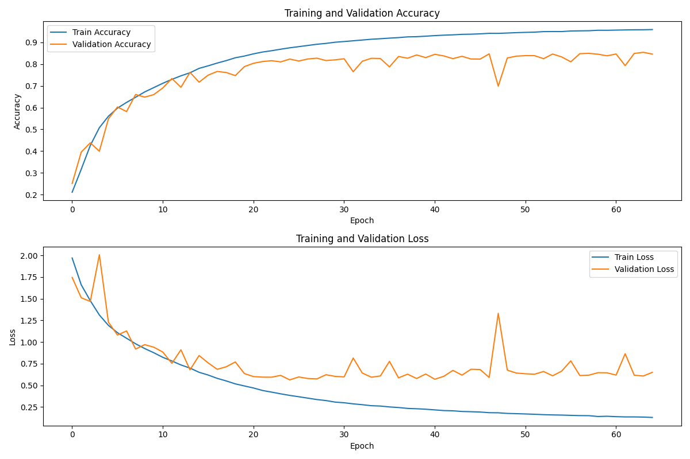
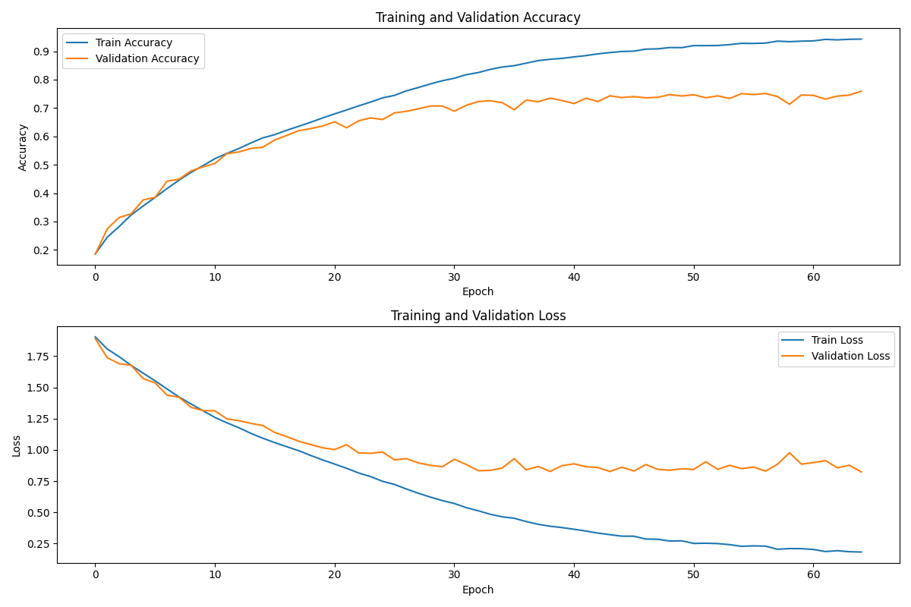

# Speech Emotion Classifier Comparison

This repository contains the code and results for a machine learning model comparison for speech emotion classification using the RAVDESS and TESS datasets. The goal was to classify seven different emotions: angry, disgust, fearful, happy, neutral, sad, and surprised.

## Preprocessing

The preprocessing steps for the audio data involved digital signal processing techniques. The key steps include:

1. **Fourier Transform:**
   - Fourier transform, specifically the Fast Fourier Transform (FFT), was used to convert the signal into a power spectral density estimate, representing different frequency bands.

2. **Downsampling and Spectrogram:**
   - Audio downsampling to 16 kHz was performed, considering the Nyquist frequency concept.
   - Introduction of spectrogram using short time Fourier transform (STFT) to visualize signal changes over time.

3. **Mel Scale and MFCCs:**
   - Introduction of the Mel scale to account for human perception of frequency differences.
   - Mel frequency cepstral coefficients (MFCCs) obtained through the discrete cosine transform (DCT) were used for feature extraction.

## Neural Network Models

Two different neural network models were used: Convolutional Neural Network (CNN) and Recurrent Neural Network (RNN) with Long Short-Term Memory (LSTM).

### Model Comparison

| Model | Training Accuracy | Validation Accuracy | Training Loss | Validation Loss | Precision | Recall | F1 Score |
|-------|-------------------|---------------------|---------------|------------------|-----------|--------|----------|
| CNN   | 0.9579            | 0.8541              | 0.1339        | 0.6077           | 0.6936    | 0.6854 | 0.6859   |
| RNN   | 0.9430            | 0.7592              | 0.1819        | 0.8233           | 0.6404    | 0.6320 | 0.6338   |

The table above summarizes the performance metrics for the CNN and RNN models on the training and validation sets. The metrics include accuracy, loss, precision, recall, and F1 score.

The Charts below show the performance of CNN and RNN through each epochs

_Performance of Convolutional Neural Network_
***

_Performance of Recurrent Neural Network (LSTM)_